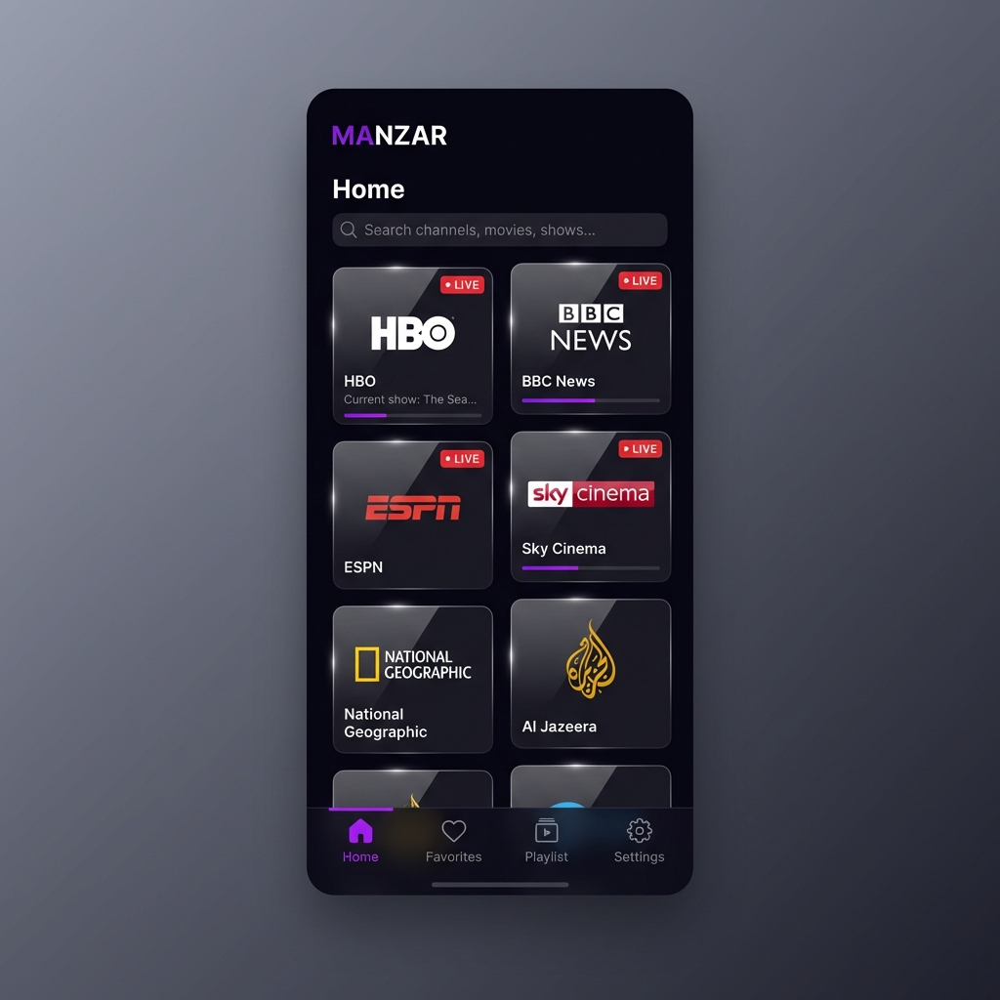
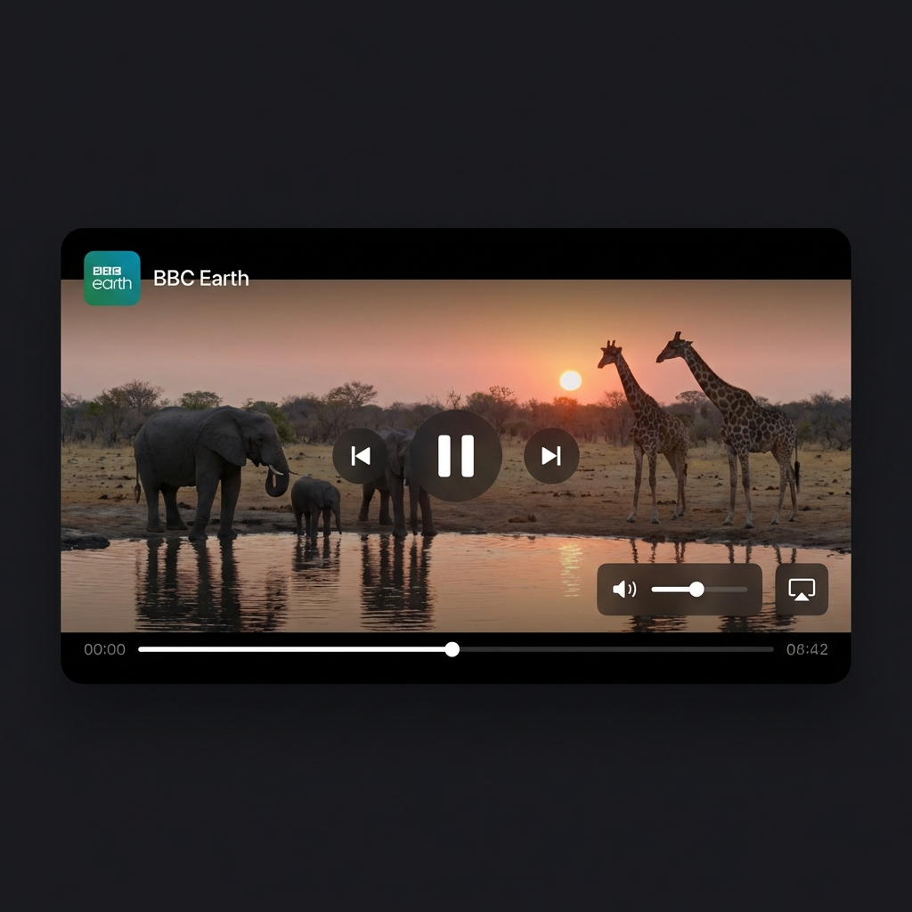
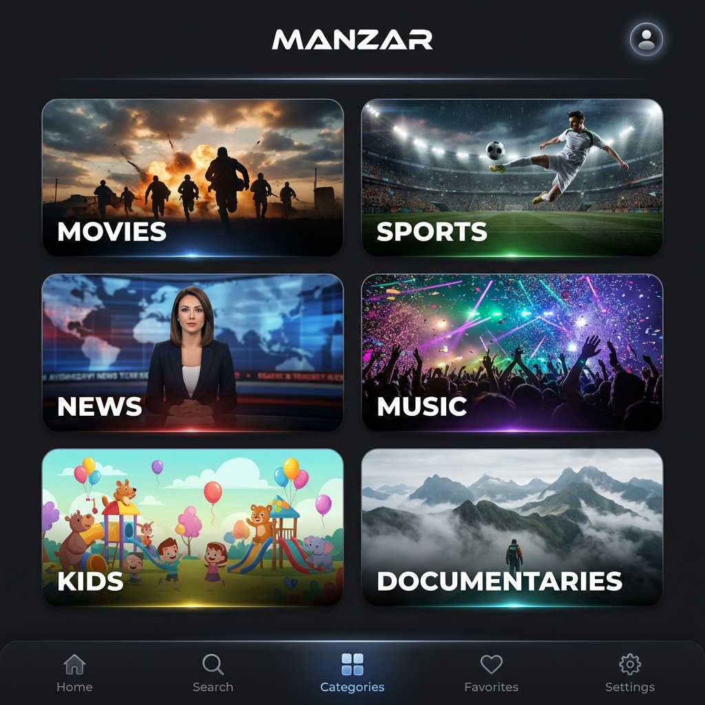

# MANZAR - Premium IPTV Player

A modern, feature-rich IPTV player built with Flutter, designed for a premium user experience with high-performance state management.

## Screenshots

<div align="center">
  <table>
    <tr>
      <td align="center"><b>Home Dashboard</b></td>
      <td align="center"><b>Live Playback</b></td>
      <td align="center"><b>Categories</b></td>
    </tr>
    <tr>
      <td></td>
      <td></td>
      <td></td>
    </tr>
  </table>
</div>

## Features

- **Modern UI/UX**: Sleek dark theme, high-quality animations, and intuitive navigation.
- **Playlist Management**: Support for M3U playlists via URL with lightning-fast parsing.
- **Public Playlists**: Built-in access to curated public playlists (Global TV, Movies, Series, Sports, and Region-specific content).
- **Advanced State Management**: Powered by GetX for reactive updates and efficient memory management.
- **Channel Organization**: Group channels by category, instant search, and a personal Favorites list.
- **Video Playback**: Premium playback experience using Chewie with aspect ratio controls and custom headers.
- **Viewing History**: Automatically tracks recently watched channels for quick access.
- **Settings**: Comprehensive data management to clear history, favorites, or cached data.

## Getting Started

1.  Clone the repository.
2.  Install dependencies:
    ```bash
    flutter pub get
    ```
3.  Run the application:
    ```bash
    flutter run
    ```

## Technology Stack

- **GetX**: High-performance, reactive state management and intelligent dependency injection.
- **Chewie & Video Player**: Robust video playback engine with customizable controls.
- **Shared Preferences**: Persistent local storage for playlists, favorites, and history.
- **Google Fonts (Inter)**: Modern and clean typography.
- **HTTP**: Reliable network communication for fetching remote playlists.
- **UUID**: Unique identification for channels and playlists.

## Note

MANZAR is a media player application. It does not provide or include any media or content. Users must provide their own content (M3U playlists). The included public links are for demonstration and educational purposes only.
